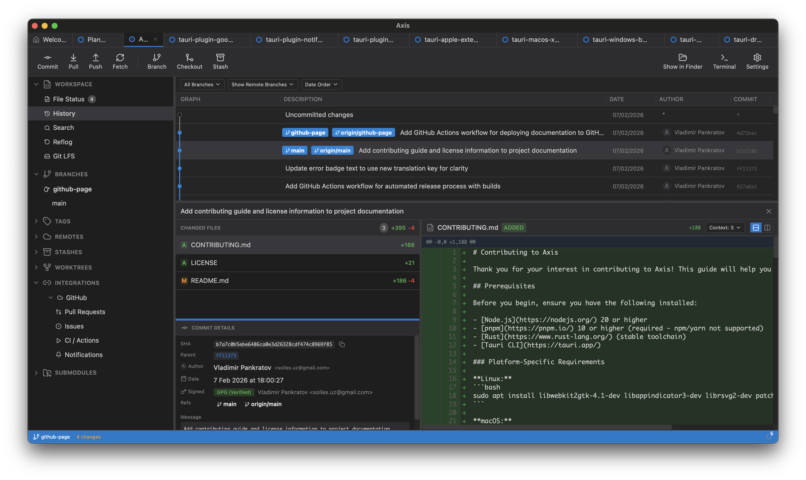
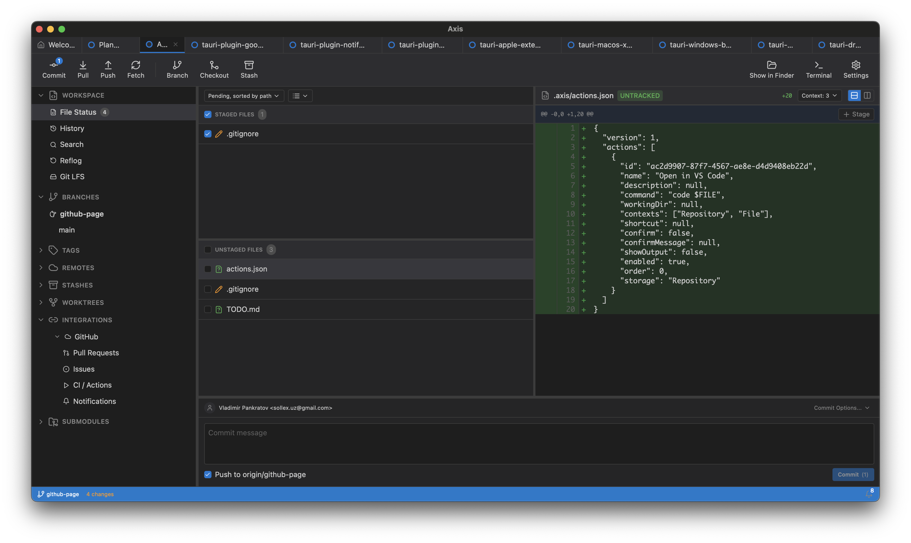

# Axis

A modern, cross-platform Git GUI built with Tauri.

[](https://github.com/choochmeque/Axis/actions/workflows/tests.yml)
[](https://github.com/choochmeque/Axis/actions/workflows/checks.yml)
[](https://codecov.io/gh/choochmeque/Axis)
[](LICENSE)
[](https://github.com/choochmeque/Axis/releases)

---

## About

Axis is a powerful Git client designed to make version control intuitive and efficient. Built with Tauri, React, and Rust, it combines a modern interface with native performance across all major desktop platforms.

## Screenshots



<details>
<summary><strong>Staging Area</strong></summary>



</details>

<details>
<summary><strong>Diff View</strong></summary>

> Screenshot needed: Side-by-side or unified diff with syntax highlighting, line numbers, and hunk staging. Demonstrates code review capabilities.

</details>

<details>
<summary><strong>Branch Management</strong></summary>

> Screenshot needed: Branch list with context menu showing local/remote branches and create/merge options. Demonstrates branch operations.

</details>

<details>
<summary><strong>Merge Conflict Resolution</strong></summary>

> Screenshot needed: Conflict resolver UI with theirs/ours/merged panels. Demonstrates conflict handling.

</details>

<details>
<summary><strong>GitHub Integration</strong></summary>

> Screenshot needed: PR list or issue panel with CI status and PR details. Demonstrates platform integrations.

</details>

---

## Features

### Core Git Operations

- Clone, init, and manage repositories
- Stage and unstage files with hunk-level precision
- Commit with message templates and amend support
- Branch creation, renaming, deletion, and comparison
- Merge and rebase with interactive conflict resolution
- Stash management with diff preview
- Tag creation and management
- Remote management (fetch, pull, push)
- Reflog navigation

### Advanced Features

- **GitHub/GitLab Integration** - Pull requests, issues, CI status, notifications
- **AI-Assisted Commits** - Generate commit messages using Claude or Ollama
- **Git LFS** - Large File Storage support
- **Worktrees** - Create and manage multiple working trees
- **Submodules** - Add and manage submodules
- **GitFlow** - Built-in GitFlow workflow support
- **Bisect** - Binary search for commits that introduced bugs
- **Patches** - Create and apply patches

### Developer Experience

- Visual commit graph with branch visualization
- Interactive rebase with preview diagrams
- Blame view with syntax highlighting
- Content search across repository history
- SSH and GPG key management for signing
- Custom actions and keyboard shortcuts
- Background fetch with notifications
- Multi-language support (i18n)

---

## Installation

### Download

Download the latest release for your platform from [GitHub Releases](https://github.com/choochmeque/Axis/releases):

| Platform | Download |
|----------|----------|
| macOS    | `.dmg`   |
| Windows  | `.exe` (NSIS installer) |
| Linux    | `.AppImage` |

### Nightly Builds

Nightly builds are available with the latest features and fixes. Check the [Releases](https://github.com/choochmeque/Axis/releases) page for builds tagged with `-nightly`.

---

## Development

### Prerequisites

- [Node.js](https://nodejs.org/) 20+
- [pnpm](https://pnpm.io/) 10+ (required)
- [Rust](https://www.rust-lang.org/) (stable)
- [Tauri CLI](https://tauri.app/)

### Quick Start

```bash
# Clone the repository
git clone https://github.com/choochmeque/Axis.git
cd Axis

# Install dependencies
pnpm install

# Start development server
pnpm tauri dev
```

### Running Tests

```bash
# Frontend tests with coverage
pnpm test:coverage

# Rust tests with coverage
cargo llvm-cov --workspace --manifest-path src-tauri/Cargo.toml

# Generate TypeScript bindings
cargo test export_typescript_bindings --manifest-path src-tauri/Cargo.toml
```

---

## Building from Source

```bash
# Build for current platform
pnpm tauri build
```

### Code Quality Checks

```bash
# Frontend
pnpm lint
pnpm typecheck
pnpm format:check

# Rust
cargo fmt --manifest-path src-tauri/Cargo.toml -- --check
cargo clippy --manifest-path src-tauri/Cargo.toml -- -D warnings
```

---

## Contributing

Contributions are welcome! Please read our [Contributing Guide](CONTRIBUTING.md) before submitting a pull request.

---

## License

This project is licensed under the MIT License - see the [LICENSE](LICENSE) file for details.
